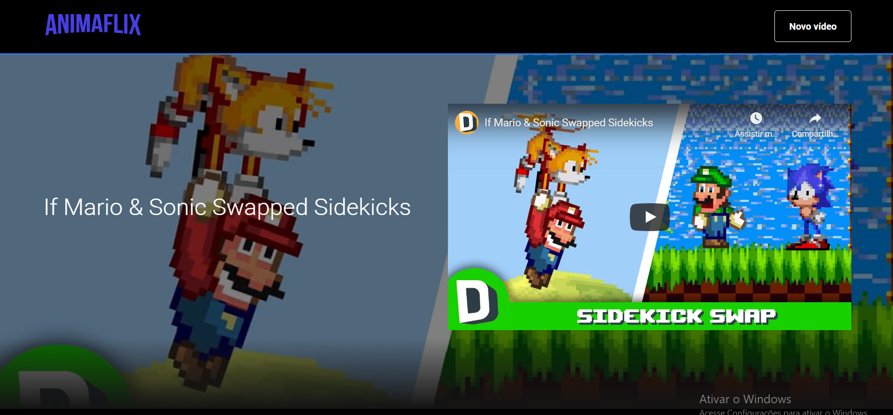
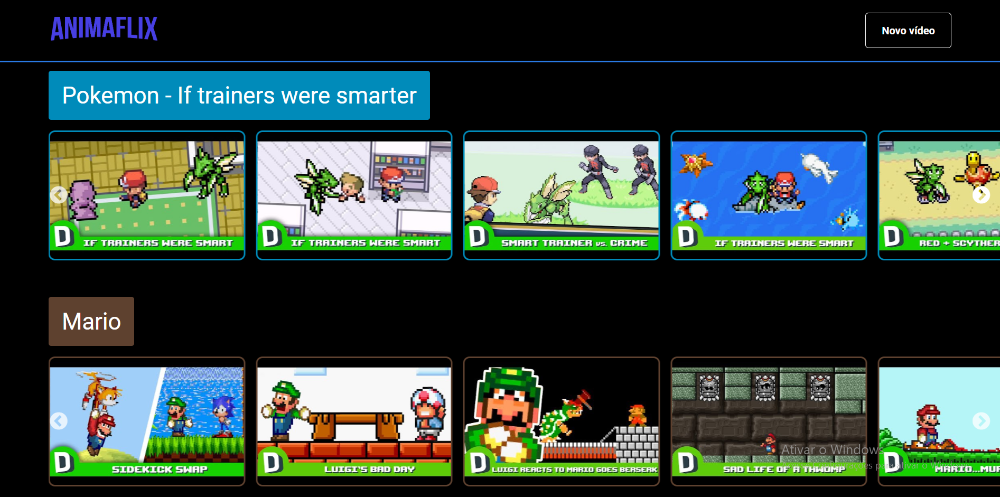

# Animaflix
> Sistema clone da Netflix, uma coletânea de animações

Sistema desenvolvido durante a Imersão React Alura, desenvolvido com React, Styled-components e Json-server. É uma coletânea de animações de canais do Youtube, dispostas em uma interface clone da Netflix





## Instalação

Este aplicativo não possui nenhum deploy, caso desejar contribuir para o desenvolvimento siga para a próxima seção.

## Configuração para Desenvolvimento

Para fazer a instalação das dependências, baixe os arquivos que compõe o projeto. Será necessário ter o NodeJS instalado na sua máquina. No terminal, acesse a pasta em que os arquivos estão e digite o seguinte código:

```sh
npm install
```

Será feito a instalação de todas as dependências do projeto

## Histórico de lançamentos

* 1.0.0
    * Versão da Imersão React Alura.

## Meta

Rilton Moreira – rilton_moreira@hotmail.com


## Contributing

1. Faça o _fork_ do projeto (<https://github.com/RiltonSM/Animaflix/fork>)
2. Crie uma _branch_ para sua modificação (`git checkout -b feature/fooBar`)
3. Faça o _commit_ (`git commit -am 'Add some fooBar'`)
4. _Push_ (`git push origin feature/fooBar`)
5. Crie um novo _Pull Request_

